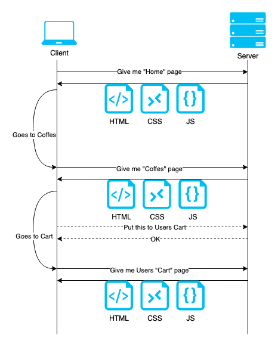
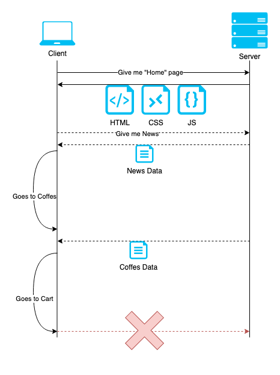
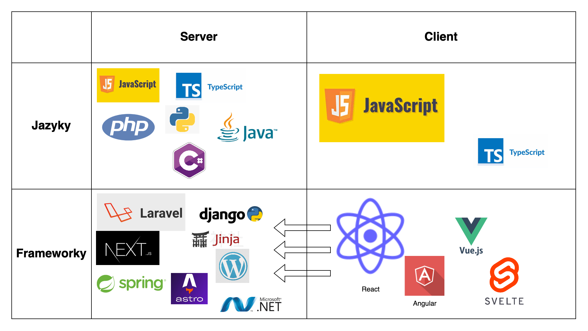

# React Crashcourse

---

# Obsah
<v-clicks>

- ## Proč je React?

- ## Kdo je React?

- ## Jak je React?

- ## Kde je React?

</v-clicks>

---
layout: section
---

# Proč je React?

---

# Proč je React?

<v-clicks>

- Jednoduchá stránka HTML/CSS: https://joecoffeecompany.com/our-story/
- Klient přijde, že chce
- *přidat položku do navigace*,
- *přidat nový typ kávy*,
- *aby se nahoře u košíku zobrazovala ikonka s počtem produktů.*
- -> **Šablonovací systémy**
- React je (mimo jiné) jedním ze šablonovacích systémů

  
</v-clicks>

---
layout: center
---

# Kdo je React?

---
layout: two-cols
---

# Server-side rendering (SSR)

- Server generuje vždy novou stránku po každé navigaci
- Stránka neví nic
- Sever vždy využje data pro sestavení celého výsledku

::right::

# Client-side redndering (CSR)

- Stránka obdží celý kód jen jednou
- Sama ví, jak se má zobrazit pomocí JS kódu
- Ze serveru stahje jen konkrétní data
- Mladší a žádanější přísup

<v-click>
   
   
   
   
  
SPA - Single-page application 
 

</v-click>

---
layout: center
---

---
layout: center
---

---
layout: center
---

---
layout: center
---
# Kdo je React?

<v-clicks>

- Šablonovací systém.
- Nejpoužívanější a nejžádanější...
- JavaScriptová knihovna/framework...
- na tvorbu single-page aplikací...
- a server-side rednering.
- Využívá JS funkce pro renderování obsahu do stránky.
- Není první, ani poslední.

</v-clicks>

---
layout: section
---

# Jak je React?

---

# Setup
1. [Codesandbox.io](https://codesandbox.io/)
2. Přihlašte se (Github nebo Google)
3. New from a template
4. React

<!-- https://codesandbox.io/s/cool-platform-3cyg4c -->

---

# Koncepty
- JSX
- Komponenty
- State
- Props
- Stylování
- Lifecycle
- Class components
- Hooky

---
layout: two-cols
---

# JSX

- HTML v JavaScriptu
- atributy se píší v lowerCamelCase - e.g. `className, onClick`
- escapování pomocí `{}`
  - lze vložit libovolný JS výraz, který lze vyrenderovat
  - možnost iterovat
  - podmníky
  
::right::

<v-click>

# Komponenty
- znovupoužitelné kusy kódu
- píší se v `UpperCamelCase`
- obvykle jedna komponenta na soubor
</v-click>

---
layout: two-cols
---
# Props
- předávání *properties* do komponent z rodičovské komponenty
- buď se používá pro nastavení komponenty, nebo pro dynamické chování
- při změně prop se překreslí i komponenta

::right::

<v-click>

# State
- způsob jak implementovat dynamické chování
- proměnná, při jejiž změně se změní překreslí daná komponenta
- používá se pomocí *hooku* `useState`

</v-click> 

---

# Stylování
- klasický stylesheet
- CSS Modules
- lze používat i SASS nebo LESS
- styled components
- různé stylovací knihovny
  - Bootstrap
  - Tailwind

---

# Lifecycle komponent
- jak se dynamicky mění obsah, komponenta prochází několika fázemi
- **Mount, Update, Unmount**
- pro každý stav existují metody, díky kterým lze volat kód v jen v dané fázi
- hodí se například když
  - manipulaci s obsahem DOM mimo React
  - stahování asynchronních dat
  - přidávání (a následně odebírání) event listenery mimo React

- https://projects.wojtekmaj.pl/react-lifecycle-methods-diagram/

---

# Class components
- starší způsob psaní komponent (funknční komponenty dříve neuměli mít state)
- již se příliš nepoužívá, ale můžete se s nimi setkat ve starším kódu
- mají lépe čitelný přístup k lifecycle metodám

---

---
layout: section
---

# Kde je React?

---

# Prerekvizity
- git
- npm
- VS Code (nebo WebStorm)